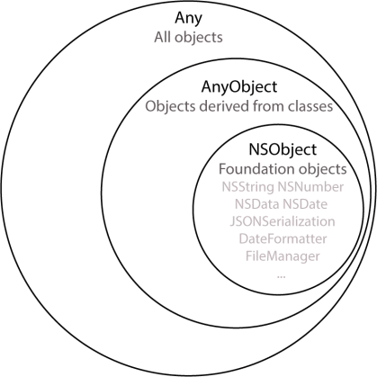

# What we will learn
autoLaout programmatically, pageControll, MVC, DataModel, CollectionView, Swaping Controll, App Delegats, sceneDelegates, as, self, Enum, Class extension, 

##Setting Up Your App Programmatically

Lets create a single view application. Crate a new file named SappingController subclass of UICollectionViewController, UICollectionViewDelegateFlowLayout

### Step 1

**Location**
Scene Delegate -> willConnectTo (Greater than ios 11 else use appDelegates: didFinishLaunchingWithOptions)

**Precedure**
* Cast scene as UIWindowScene and store into windowScene constant
* Create new window from those Scene
* Initialozted a view controller with a layout
* Now set this window root view controller and make key(main) and visible

**Output**
This code will load a new window instend of main storyboard view from viewcontroller. Now we can create visible output from new assign view controller.


```swift
if let windowScene = scene as? UIWindowScene {
            self.window = UIWindow(windowScene: windowScene)
            let layout = UICollectionViewFlowLayout()
            layout.scrollDirection = .horizontal
            
            let swipingController = SwapingController(collectionViewLayout: layout)
          
            self.window!.rootViewController = swipingController
            self.window!.makeKeyAndVisible()
        }
        
```

### Step 2

**Location**
SwapingController

**Precedure**
We will create some propertise, say previousButton, nextButton  and pageControl. Here we will create propertie using a closur and last we will call it by ().

**Output**
No visible output untill view.addSubview(propertiseName) method called.


```swift
 let pageControl: UIPageControl = {
        let pc = UIPageControl()
        pc.currentPage = 0
        pc.numberOfPages = 5 //pages.count
        pc.currentPageIndicatorTintColor = .mainPink
        pc.pageIndicatorTintColor = .gray
        return pc
    }()
    let previousButton: UIButton = {
        let button = UIButton(type: .system)
        button.setTitle("PREV", for: .normal)
        button.titleLabel?.font = UIFont.boldSystemFont(ofSize: 14)
        //let pinkColor: UIColor = UIColor.init(red: 232/255, green: 68/255, blue: 133/255, alpha: 1)
        button.setTitleColor(.mainPink, for: .normal)
        //button.backgroundColor = .brown
        button.addTarget(self, action: #selector(handlePrev), for: .touchUpInside)
        button.translatesAutoresizingMaskIntoConstraints = false
        return button
    }()
 
    let nextButton: UIButton = {
           let button = UIButton(type: .system)
           button.setTitle("NEXT", for: .normal)
           button.titleLabel?.font = UIFont.boldSystemFont(ofSize: 14)
        //let pinkColor: UIColor = UIColor.init(red: 232/255, green: 68/255, blue: 133/255, alpha: 1)
        button.setTitleColor(.mainPink, for: .normal)
           //button.backgroundColor = .brown
        button.addTarget(self, action: #selector(handleNext), for: .touchUpInside)
           button.translatesAutoresizingMaskIntoConstraints = false
           return button
       }()        
```


### Step 3

**Location**
SwapingController

**Precedure**
On setupBottomControls function we will add a stack view using those three button
bottomControlStackView.translatesAutoresizingMaskIntoConstraints propertise help us to setup constrint programmatically
view.addSubview(bottomControlStackView) method will add an instance of stack view to the view
NSLayoutConstraint.activate([ ]) method will help us to add four constraint to the stack view to attach this stack at the bottom of the view
Finall we will call the function using ViewDidLoad default method
**Output**
this code will visible a bottom stack view


```swift
 fileprivate func setupBottomControls(){
               let bottomControlStackView: UIStackView = UIStackView(arrangedSubviews: [previousButton, pageControl, nextButton])
               bottomControlStackView.translatesAutoresizingMaskIntoConstraints = false
               bottomControlStackView.distribution = .fillEqually
               view.addSubview(bottomControlStackView)
               NSLayoutConstraint.activate([
               bottomControlStackView.leadingAnchor.constraint(equalTo: view.safeAreaLayoutGuide.leadingAnchor),
               bottomControlStackView.trailingAnchor.constraint(equalTo: view.safeAreaLayoutGuide.trailingAnchor),
               bottomControlStackView.bottomAnchor.constraint(equalTo: view.safeAreaLayoutGuide.bottomAnchor),
               bottomControlStackView.heightAnchor.constraint(equalToConstant: 60)
               ])
           }      
```

### Step 4

**Location**
Pages.swift

**Precedure**
We will create a new swift file named Pages.swift for data model

**Output**

```swift
import UIKit

struct Page{
    let image: String
    let title: String
    let description: String
}
```

### Step 5

Create new swift file PageCell subclass of UICollectionViewCell. Init fram and coder method.
**Location**
PageCell

**Precedure**
Here we will design our prototype cell. Create two propertise for UIImageView logoImageView & UITextView descriptionTextView. add constring for those propertise on setupLayout function and call it using init frame Method.
Finally we will create a variable page of type Pages under didSet method to set some attribute for those propertise.

**Code**

```swift
import UIKit

class PageCell: UICollectionViewCell {
    
    var page : Page? {
        didSet{
            //print("\(page!.image)")
            guard let unrapedPage = page else {return}
            logoImageView.image = UIImage(named: unrapedPage.image)
            let attributedText = NSMutableAttributedString(string: unrapedPage.title, attributes: [NSAttributedString.Key.font: UIFont.systemFont(ofSize: 24), NSAttributedString.Key.foregroundColor : UIColor.red ])
            
            attributedText.append(NSMutableAttributedString(string: "\n\n\n \(unrapedPage.description)", attributes: [NSAttributedString.Key.font: UIFont.systemFont(ofSize: 12), NSAttributedString.Key.foregroundColor: UIColor.gray]))

         descriptionTextView.attributedText = attributedText
            descriptionTextView.textAlignment = .center
        }
    }
    let logoImageView : UIImageView = {
    let myImage = UIImage()
    let imageView = UIImageView(image: myImage)
        imageView.contentMode = .scaleAspectFill
    imageView.translatesAutoresizingMaskIntoConstraints = false
    return imageView
    }()
    let descriptionTextView: UITextView = {
        let textView = UITextView()
        textView.translatesAutoresizingMaskIntoConstraints = false
        return textView
    }()
    override init(frame: CGRect) {
        super.init(frame: frame)
    
//        backgroundColor = .yellow
        setupLayout()
    }
    
    required init?(coder: NSCoder) {
            fatalError("init(coder:) has not been implemented")
    }
    
    private func setupLayout(){
       let topImageContainer = UIView()
        //topImageContainer.backgroundColor = .brown
        addSubview(topImageContainer)
        topImageContainer.translatesAutoresizingMaskIntoConstraints = false // enable atuo layout
        topImageContainer.topAnchor.constraint(equalTo: topAnchor).isActive = true
        topImageContainer.leftAnchor.constraint(equalTo: leftAnchor).isActive = true
        topImageContainer.rightAnchor.constraint(equalTo: rightAnchor).isActive = true
        topImageContainer.heightAnchor.constraint(equalTo: heightAnchor, multiplier: 0.5).isActive = true
        topImageContainer.addSubview(logoImageView)
        logoImageView.centerXAnchor.constraint(equalTo: topImageContainer.centerXAnchor).isActive = true
        logoImageView.centerYAnchor.constraint(equalTo: topImageContainer.centerYAnchor).isActive = true
        logoImageView.widthAnchor.constraint(equalToConstant: 200).isActive = true
        logoImageView.heightAnchor.constraint(equalTo: topImageContainer.heightAnchor, multiplier: 0.5).isActive = true
       
        addSubview(descriptionTextView)
       descriptionTextView.topAnchor.constraint(equalTo: topImageContainer.bottomAnchor, constant: 10).isActive = true
       descriptionTextView.leftAnchor.constraint(equalTo: leftAnchor, constant: 0).isActive = true
       descriptionTextView.rightAnchor.constraint(equalTo: rightAnchor, constant: 0).isActive = true
       descriptionTextView.bottomAnchor.constraint(equalTo: bottomAnchor, constant: 0).isActive = true
    }
    
}
```

### Step 6

**Location**
SwappingController

**Precedure**
Here we will add some image into Assets.xcassets. and create a database using Page Data model.

**Code**

```swift
 var pages: [Page] = [
        Page(image: "Artboard 1", title: "TOM AND JERRY 1", description: "Lorem Ipsum is simply dummy text of the printing and typesetting industry. Lorem Ipsum has been the industry's standard dummy text ever since the 1500s, when an unknown printer took a galley of type and scrambled it to make a type specimen book."),
         Page(image: "Artboard 2", title: "TOM AND JERRY 2", description: "Lorem Ipsum is simply dummy text of the printing and typesetting industry. Lorem Ipsum has been the industry's standard dummy text ever since the 1500s, when an unknown printer took a galley of type and scrambled it to make a type specimen book."),
          Page(image: "Artboard 2 copy", title: "TOM AND JERRY 3", description: "Lorem Ipsum is simply dummy text of the printing and typesetting industry. Lorem Ipsum has been the industry's standard dummy text ever since the 1500s, when an unknown printer took a galley of type and scrambled it to make a type specimen book."),
           Page(image: "Artboard 2 copy 2", title: "TOM AND JERRY 4", description: "Lorem Ipsum is simply dummy text of the printing and typesetting industry. Lorem Ipsum has been the industry's standard dummy text ever since the 1500s, when an unknown printer took a galley of type and scrambled it to make a type specimen book."),
            Page(image: "Artboard 2 copy 3", title: "TOM AND JERRY 5", description: "Lorem Ipsum is simply dummy text of the printing and typesetting industry. Lorem Ipsum has been the industry's standard dummy text ever since the 1500s, when an unknown printer took a galley of type and scrambled it to make a type specimen book."),
    ]
```

### Step 7

**Location**
SwappingController

**Precedure**
Here we will add some image into Assets.xcassets. and create a database using Page Data model. Registered a cell on ViewDidLoad Method

```swift
           collectionView.register(PageCell.self, forCellWithReuseIdentifier: "CellId")
```

### Step 8

**Location**
SwappingController

**Precedure**

We will add default protocol method of UICollectionViewController, numberOfItemsInSection, cellForItemAt indexPath and two another method  sizeForItemAt indexPath for make collectionView cell fullscren and minimumLineSpacingForSectionAt fro removeing extra spacing around the cell. make sure collectionView.isPagingEnabled = true on ViewDidLoad method.


```swift
         func collectionView(_ collectionView: UICollectionView, layout collectionViewLayout: UICollectionViewLayout, minimumLineSpacingForSectionAt section: Int) -> CGFloat {
        return 0
    }
    override func collectionView(_ collectionView: UICollectionView, numberOfItemsInSection section: Int) -> Int {
        return pages.count
    }
    override func collectionView(_ collectionView: UICollectionView, cellForItemAt indexPath: IndexPath) -> UICollectionViewCell {
        let cell = collectionView.dequeueReusableCell(withReuseIdentifier: "CellId", for: indexPath) as! PageCell
//        let currentImage = imagesAre[indexPath.item]
//        cell.logoImageView.image = UIImage(currentImage)
        
        /* //this code will work before making data model page on PageCell
        let currentSlide = pages[indexPath.item]
        cell.logoImageView.image = UIImage(named: currentSlide.image)
        
        let attributedText = NSMutableAttributedString(string: currentSlide.title, attributes: [NSAttributedString.Key.font: UIFont.systemFont(ofSize: 24), NSAttributedString.Key.foregroundColor : UIColor.red ])
        
        attributedText.append(NSMutableAttributedString(string: "\n\n\n \(currentSlide.description)", attributes: [NSAttributedString.Key.font: UIFont.systemFont(ofSize: 12), NSAttributedString.Key.foregroundColor: UIColor.gray]))
        
        cell.descriptionTextView.attributedText = attributedText
        cell.descriptionTextView.textAlignment = .center
        cell.descriptionTextView.isEditable = false
        cell.descriptionTextView.isScrollEnabled = false*/
        
        cell.backgroundColor = indexPath.item % 2 == 0 ? .red : .orange
        cell.page = pages[indexPath.row] //Here we can access set private propertise
        return cell
    }
     func collectionView(_ collectionView: UICollectionView, layout collectionViewLayout: UICollectionViewLayout, sizeForItemAt indexPath: IndexPath) -> CGSize {
        return CGSize(width: view.frame.width, height: view.frame.height)
//        return CGSize(width: preferredWidth, height: floor(preferredHeight))
//        return CGSize(width: view.frame.width , height: view.frame.height - (view.safeAreaInsets.top + view.safeAreaInsets.bottom))

    }
```

### Step 9

**Location**
SwappingController

**Precedure**

Here we will enable button control for Prev and Next Button to swap the cell and swap by dragging we will add the follwing function scrollViewWillEndDragging


```swift
@objc private func handlePrev(){
          
          let currentPage = max(pageControl.currentPage - 1, 0)
          let indexPath = IndexPath(item: currentPage, section: 0)
          collectionView.scrollToItem(at: indexPath, at: .centeredHorizontally, animated: true)
          pageControl.currentPage = currentPage
          print("handleNext", currentPage)
      }
      @objc private func handleNext(){
        
        let currentPage = min(pageControl.currentPage + 1, pages.count-1)
        let indexPath = IndexPath(item: currentPage, section: 0)
        collectionView.scrollToItem(at: indexPath, at: .centeredHorizontally, animated: true)
        pageControl.currentPage = currentPage
        print("handleNext", currentPage)
    }
    override func scrollViewWillEndDragging(_ scrollView: UIScrollView, withVelocity velocity: CGPoint, targetContentOffset: UnsafeMutablePointer<CGPoint>) {
        let contentXOffset = targetContentOffset.pointee.x, frameWidth = view.frame.width
        pageControl.currentPage = Int(contentXOffset / frameWidth)
        print(contentXOffset, frameWidth, contentXOffset/frameWidth)
       
    }
```


[The Scene Delegate In Xcode 11 And iOS 13
](https://learnappmaking.com/scene-delegate-app-delegate-xcode-11-ios-13/)

#Related Study

## appdelegate vs scenedelegate

The AppDelegate will be responsible for the application lifecycle and setup. The SceneDelegate will be responsible for what is shown on the screen (Windows or Scenes) handle and manage the way your app is shown

Note
as use for type casting

**Related Stady**
# Type Casting: is, as, as?, as!, downcasting, upcasting, Any

Type casting is a way to check the type of an instance, or to treat that instance as a different superclass or subclass from somewhere else in its own class hierarchy.

Type casting in Swift is implemented with the is and as operators. is is used to check the type of a value whereas as is used to cast a value to a different type.

```swift
class MediaItem {
    var name: String
    init(name: String) {
        self.name = name
    }
}

class Movie: MediaItem {
    var director: String
    init(name: String, director: String) {
        self.director = director
        super.init(name: name)
    }
}

class Song: MediaItem {
    var artist: String
    init(name: String, artist: String) {
        self.artist = artist
        super.init(name: name)
    }
}
let library = [
    Movie(name: "Casablanca", director: "Michael Curtiz"),
    Song(name: "Blue Suede Shoes", artist: "Elvis Presley"),
    Movie(name: "Citizen Kane", director: "Orson Welles"),
    Song(name: "The One And Only", artist: "Chesney Hawkes"),
    Song(name: "Never Gonna Give You Up", artist: "Rick Astley")
]
// the type of "library" is inferred to be [MediaItem]

```

Checking Type (is)

```swift
var movieCount = 0
var songCount = 0

for item in library {
    if item is Movie {
        movieCount += 1
    } else if item is Song {
        songCount += 1
    }
}

print("Media library contains \(movieCount) movies and \(songCount) songs")
// Prints "Media library contains 2 movies and 3 songs"
```

**Downcasting**

A constant or variable of a certain class type may actually refer to an instance of a subclass behind the scenes. Where you believe this is the case, you can try to downcast to the subclass type with a type cast operator (as? or as!).

Because downcasting can fail, the type cast operator comes in two different forms. The conditional form, as?, returns an optional value of the type you are trying to downcast to. The forced form, as!, attempts the downcast and force-unwraps the result as a single compound action.

Use the conditional form of the type cast operator (as?) when you are not sure if the downcast will succeed. This form of the operator will always return an optional value, and the value will be nil if the downcast was not possible. This enables you to check for a successful downcast.

```swift
for item in library {
    if let movie = item as? Movie {
        print("Movie: \(movie.name), dir. \(movie.director)")
    } else if let song = item as? Song {
        print("Song: \(song.name), by \(song.artist)")
    }
}
// Movie: Casablanca, dir. Michael Curtiz
// Song: Blue Suede Shoes, by Elvis Presley
// Movie: Citizen Kane, dir. Orson Welles
// Song: The One And Only, by Chesney Hawkes
// Song: Never Gonna Give You Up, by Rick Astley
```

### Difference between as? and as!

Downcasting can be done in two ways:
Conditional downcasting (as?).
Forced downcasting (as!).
The conditional form, as?, returns an optional value of the type you are trying to downcast to. The forced form, as!, attempts the downcast and force-unwraps the result as a single compound action.

Use the conditional form of the type cast operator (as?) when you are not sure if the downcast will succeed. This form of the operator will always return an optional value, and the value will be nil if the downcast was not possible. This enables you to check for a successful downcast.

Use the forced form of the type cast operator (as!) only when you are sure that the downcast will always succeed. This form of the operator will trigger a runtime error if you try to downcast to an incorrect class type.

```
let movie = library[1] as! Movie //forced downcasting to Movie
//error and crashes

```
In this scenario, where we are not sure if the casting succeeds, we should use the conditional downcasting as? .

```swift
let movie = library[0] as? Movie
 // success, returns Movie?
let movie = library[1] as? Movie
//nil
```

Upcasting
Upcasting from the base class object to its superclass is also possible. Let’s convert the animalObject created by forced downcasting back to the LivingBeing class.

```swift
let movieObj = library[0] as! Movie
let movieObjAsMediaItemObj = movieObj as MediaItem
```

**Type Casting for Any and AnyObject**
Swift provides two special types for working with nonspecific types:
Any can represent an instance of any type at all, including function types.
AnyObject can represent an instance of any class type.


[Medium](https://medium.com/@abhimuralidharan/typecastinginswift-1bafacd39c99)
|
[Apple Doc](https://docs.swift.org/swift-book/LanguageGuide/TypeCasting.html)